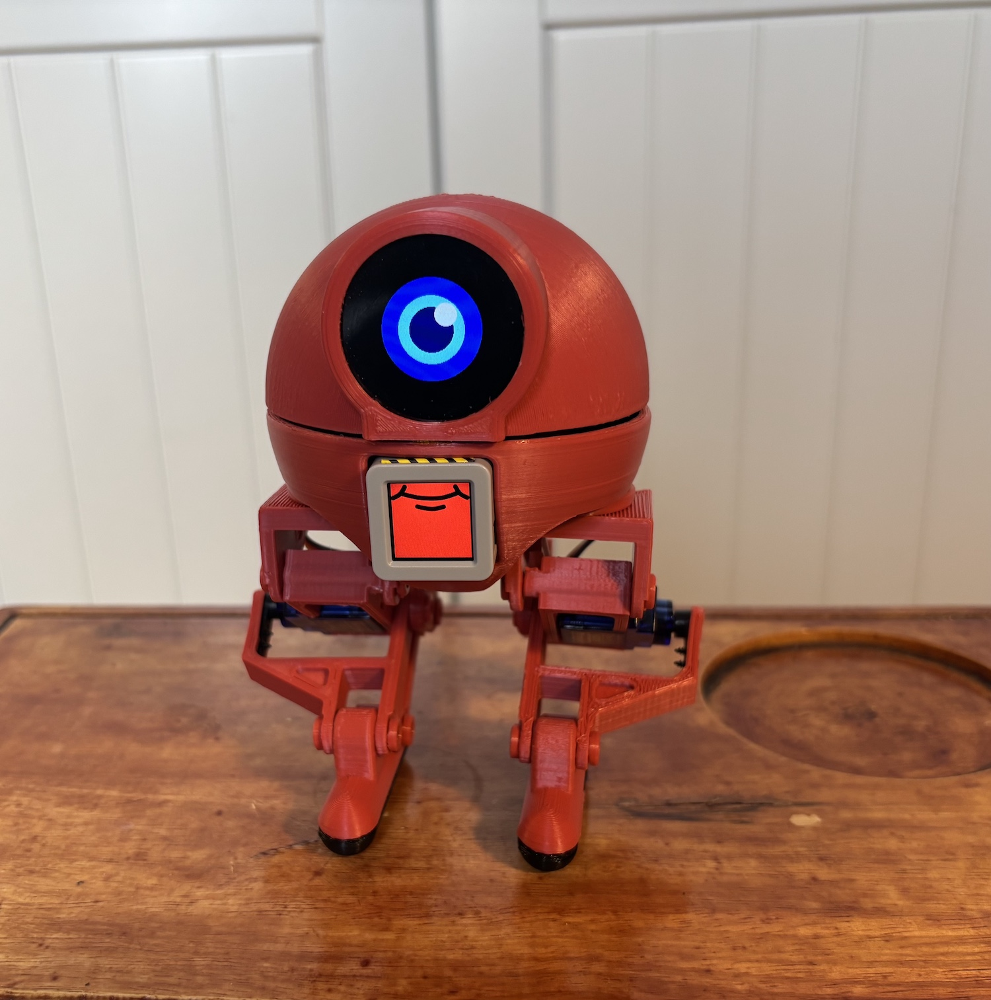
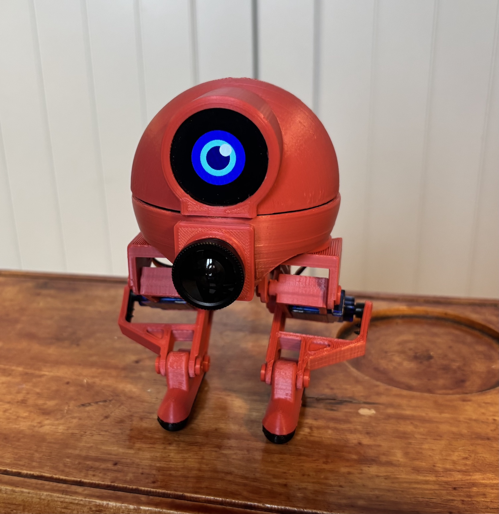
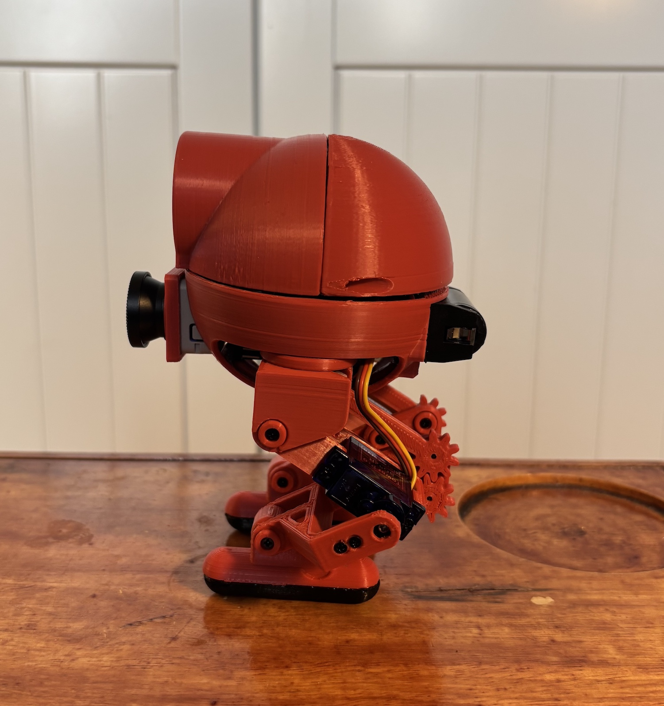
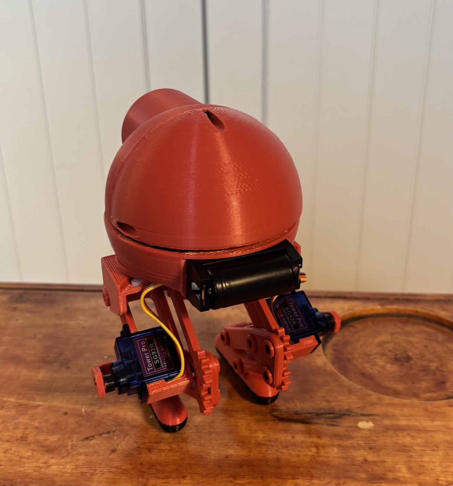
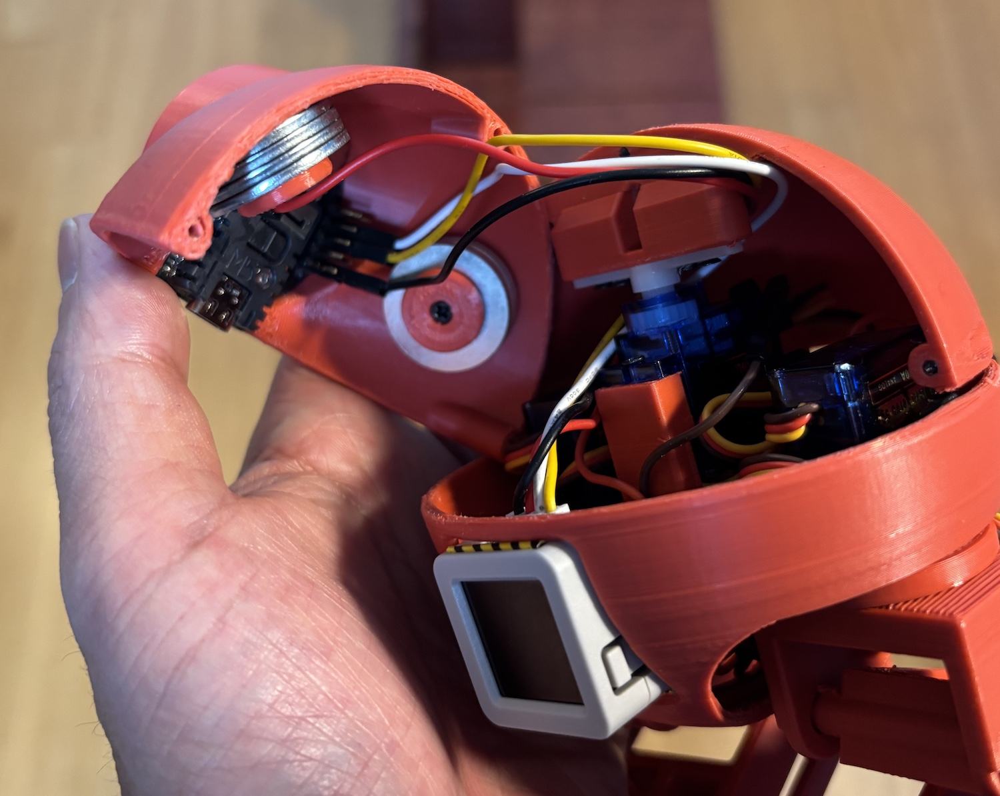
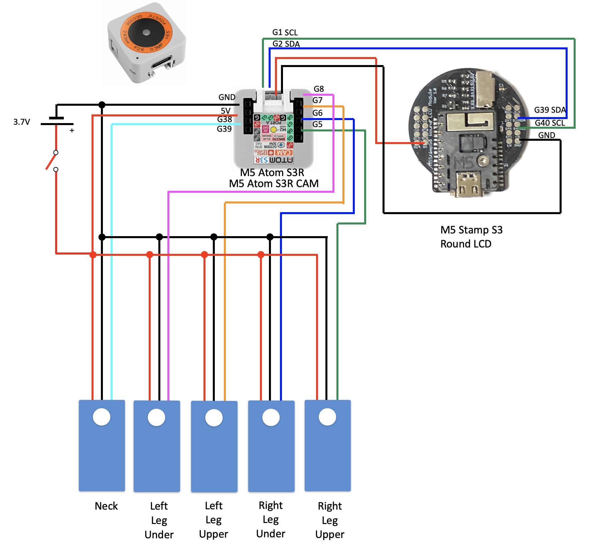

# NX27

I made mono eye simple robot with M5 Atom S3R
- Simple and cheep as much as possible  
-  Cute and Cool  
-  It can be replace to M5 Atom S3R CAM
-  Trucking Face  

[Summary]
http://robo-takao.jp/NX27/e/index.html

[Components]  
1)M5 Atom S3R M5 or Atom S3 R CAM  
2)M5 Stamp S3 with Round LCD  
3)Servos SG92R x 5  
4)Lithium Ion Battery 3.7V  

[Connection]  

[Code]  
M5AtomS3R  
- NX27_M5AtomS3R  
M5AtomS3RCAM  
- NX27_M5AtomS3RCAM_FD  
M5StampS3  
- NX27_M5StampS3  
M5StickC with JoyC  
- NX25_M5StickC_joyC  
